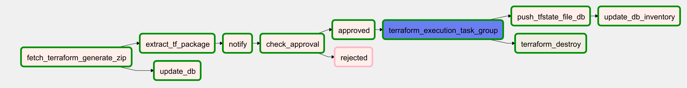
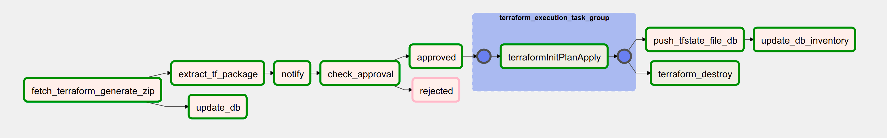
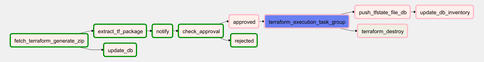
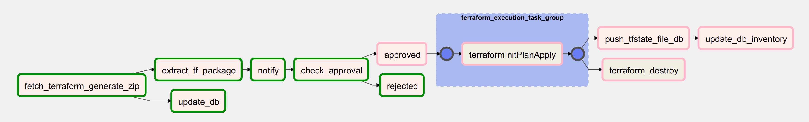

# Airflow 

1. To enable REST endpoints - https://airflow.apache.org/docs/apache-airflow/stable/security.html#api-authentication Add the below in airflow.cfg
   [api]
   auth_backend = airflow.api.auth.backend.default

2. Airflow Stable RESt API spec can be downloaded and import in POSTMAN - https://airflow.apache.org/docs/apache-airflow/stable/stable-rest-api-ref.html

3. Concept of schedule_interval and start_date
   https://airflow.apache.org/docs/apache-airflow/stable/dag-run.html

4. When DAG is keep running and never executed - 
   https://stackoverflow.com/questions/43507252/example-dag-gets-stuck-in-running-state-indefinitely#:~:text=What%20this%20means%20is%20that,ON'%20for%20the%20particular%20DAG

5. All DAGS are PAUSED by default during creation time. Set this property to False
    # Are DAGs paused by default at creation
    dags_are_paused_at_creation = False

6. Commands
   -  Dags and Task Validation - https://airflow.apache.org/docs/apache-airflow/stable/tutorial.html#command-line-metadata-validation
   -  Testing Tasks - https://airflow.apache.org/docs/apache-airflow/stable/tutorial.html#id2 
   -  Note that if you use depends_on_past=True, individual task instances will depend on the success of their previous task instance (that is, previous according to execution_date). Task instances with execution_date==start_date will disregard this dependency because there would be no past task instances created for them.
   - https://airflow.apache.org/docs/apache-airflow/stable/tutorial_taskflow_api.html

7. Taskflow API introduced in Airflow 2.0 is very important which abstract away all the dependencies of XCOM - https://airflow.apache.org/docs/apache-airflow/stable/tutorial_taskflow_api.html

8. All concepts - https://airflow.apache.org/docs/apache-airflow/stable/concepts.html

9. How multiple_outputs=True works - https://airflow.apache.org/docs/apache-airflow/stable/tutorial_taskflow_api.html#multiple-outputs-inference
   Same function can work with multiple output based on input. More info
      https://airflow.apache.org/docs/apache-airflow/stable/concepts.html#taskflow-api
      https://airflow.apache.org/docs/apache-airflow/stable/concepts.html#dag-decorator
      
10. Passing parameter when trigger a DAG - https://airflow.apache.org/docs/apache-airflow/stable/dag-run.html#passing-parameters-when-triggering-dags

# How to run the Pipeline
1. run the folowing commands in 2 terminals
    airflow webserver --port 8080
    airflow scheduler
2. Run fake SMTP server with Python - https://jingwen-z.github.io/how-to-send-emails-with-python/
    sudo python -m smtpd -n -c DebuggingServer localhost:25
3. Run the HumanApproval.py where the checkApproval endpoint will be used by VMCreationPOC DAG
    python HumanApproval.py
    
 ### Approved Workflow Diagram as Code
 
 
 ### Approved Workflow Task Group
 
 
 ### Rejected Workflow Diagram as Code
 
 
 ### Rejected Workflow Task Group
 
 
 ### Trigger a DAG
 curl -X POST  'http://localhost:8080/api/experimental/dags/VMCreationPOC/dag_runs' --header 'Content-Type: application/json' --header 'Cache-Control: no-cache' --data '{"replace_microseconds":"false"}'

    

   
