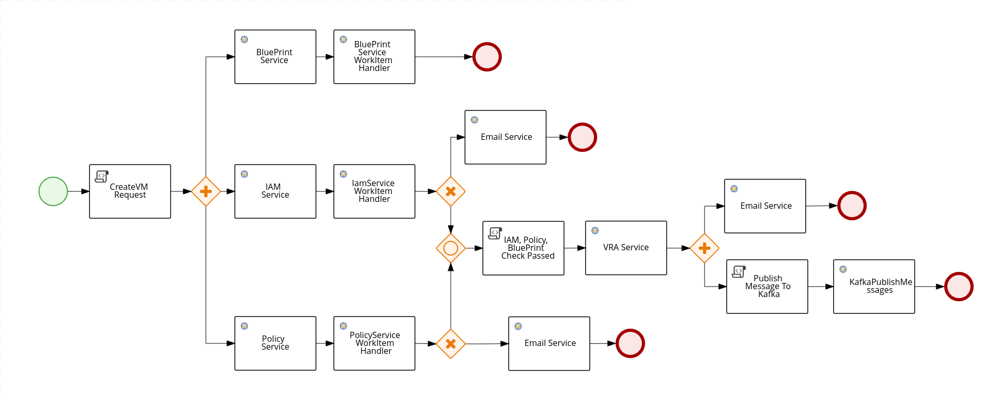

# business-applications
In this POC, we are sending the request to create a VM which is a POST call and it will give you the response back.
This POC covers many functionalities which includes
* BPMN Gateways
* Make GET Calls from JBPM
* Make POST Calls from JBPM
* Publish Event to Kafka
* Send email if something goes wrong.




This POC includes 3 main components
* JBPM component create-vm which have 3 components
    * `create-vm-kjar` which is a knowledge jar contains the workflow and wid file
    * `create-vm-model` which has models and workitem handlers
    * `create-vm-service` which is the main service to call initiate the workflow.
* microservice which will be called by workflow
* spring-kafka project which has the consumer and listner but for this POC only the consumer is being used.

# Steps to test
Below are the steps how we can test the comple workflow.
* Execute the microservice project by executing this command
    ```sh
        $ mvn spring-boot:run -Dspring-boot.run.arguments=--server.port=8081
    ```
* Execute spring-kaka project, this will need kafka and zookeeper running on your localhost. I havent change port or antthing, it should run on the default settings.
    ```sh
        $ mvn clean install
    ```
* Execute create-vm-service
    ```sh
        $ ./launch.sh clean install
    ```